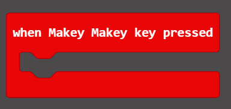
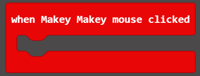
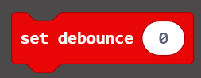

# Makey Makey Code-a-Key MakeCode Package

This is an extension which allows you to use the [Makey Makey](https://www.makeymakey.com) with the micro:bit through the [Code-a-Key backpack](https://www.makeymakey.com).  The Code-a-Key backpack allows you to:

* Program the micro:bit to send keyboard and mouse input to a computer through the attached Makey Makey
* Program the micro:bit to respond to *key presses* and *mouse clicks* triggerd by the Makey Makey

## Basic Blocks

* 
This block initializes the Code-a-Key backpack and the Makey Makey and *must be used* before any of the other blocks will work.  You will almost always put this at the top of your `On Start` event block.

* 
This block causes the Makey Makey to trigger a key-press of the selected key followed by a key-release with a brief delay between them.  When you type a key on the keyboard it sends 2 events to the computer:
* key *press* when you press the key down  
* key *release* when you let the key come bakc up. 

This block combines both of these events in one block for ease of use.

By default the delay between press and release will be 50ms but it can be adjusted using the `Set Debounce` block in the *advanced* section.

* 
This is an *event* block that is triggered whenever the Makey Makey sends a key-press to the computer.  This block cannot distinguish between different Makey Makey keys and triggers for all of them.

* 
This block causes the Makey Makey to trigger a mouse-click of the selected mouse-button.  A mouse-click consists of two distinct events with a brief delay between them.
* a mouse *down* event when you press the mouse button
* a mouse *up* event when you release the mouse button

This block combines both of these events in one block for ease of use.

By default the delay between press and release will be 50ms but it can be adjusted using the `Set Debounce` block in the *advanced* section.

* 
This block causes the Makey Makey to move the mouse-cursor in the selected direction for the chosen amount of time.  This block will cause code execution to stop during the mouse-movement.

* 
This is an *event* block that is triggered whenever the Makey Makey sends a mouse-click to the computer.  This block cannot distinguish between the LEFT and RIGHT mouse buttons and triggers for both of them.

## Advanced Blocks
The following blocks are in the *...more* section of the extension.  They allow you to trigger pressing and releasing keys and mouse-buttons separately.  This allows you to write code that holds buttons down, triggers more than one key press at a time, and other more elaborate behaviors.

This block causes the Makey Makey to press *and hold down* a key.  The key will be held down until it is *released* with a `Release Key` block.

This block causes the Makey Makey to release a key.  This will stop the key that was triggered from a `Press Key` block from being *held down*.

This block causes the Makey Makey to press *and hold down* a mouse button.  The mouse button will be held down until it is *released* with a `Release Mouse Button` block.

This block causes the Makey Makey to release a mouse button.  This will stop the key that was triggered from a `Press Mouse Button` block from being *held down*.

This block causes the Makey Makey to start moving the mouse in the given direction.  The mouse will continue to move in that direction until it is stopped by  a `Stop Mouse` block.

This block causes the Makey Makey to stop moving the mouse in the given direction.

This block sets the *debounce* timing for the `press-and-release` and `click` blocks.  In order for these blocks to function they must have a small delay between when they trigger the `press` event and when they trigger the `release` event in order for the computer to recognize that these events occurred.

This delay is called the _debounce_ time.  If the _debounce_ time is too low, the key will be _pressed_ and then _released_ before the computer notices that it was ever pressed.  If the _debounce_ time is too high, there will be a noticeable lag in the `Press and Release` and `Click Mouse Button` blocks.  

The default _debounce_ time is 50ms and should be suitable for the vast majority of hardware configuration and use-cases.
